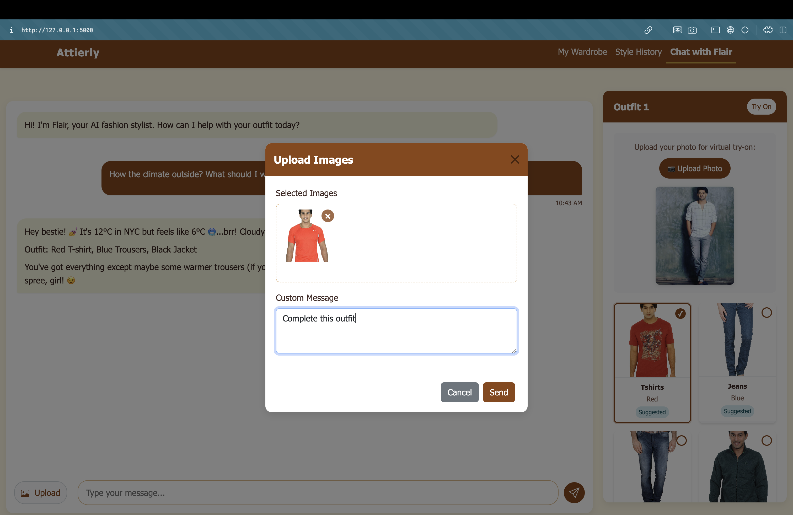
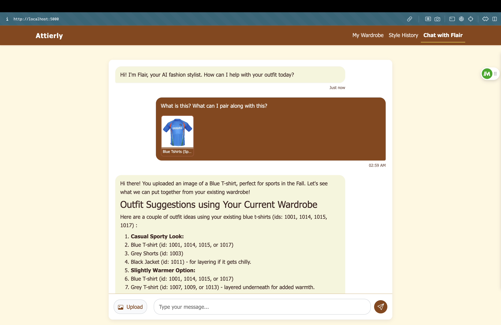
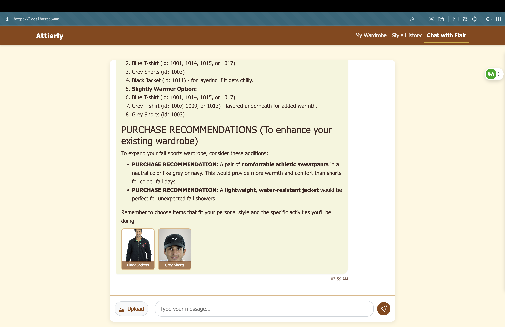
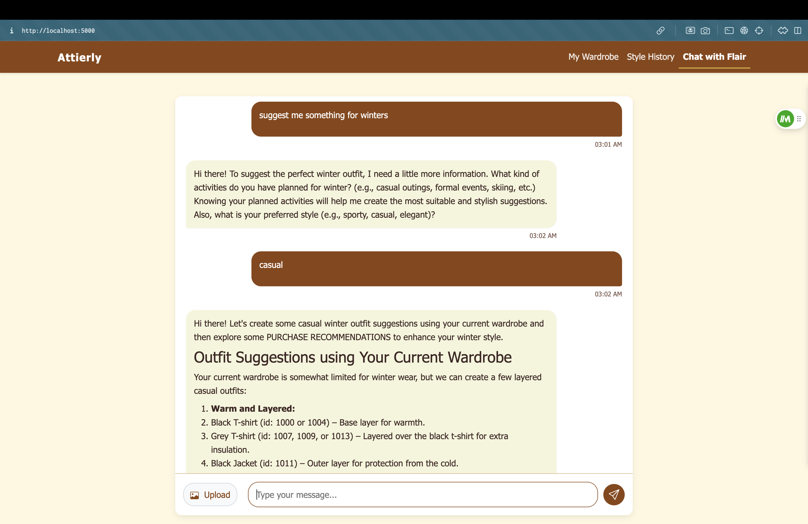

# Attierly - AI Fashion Assistant

<!--  -->

## Overview

Attierly is an advanced AI fashion assistant that uses computer vision and machine learning to provide personalized outfit recommendations, wardrobe management, and style advice. Built with a Python/Flask backend and a responsive web interface, it combines real-time clothing classification with natural language processing to deliver a seamless styling experience.

## Key Features

- **Real-time Fashion Classification**: Identifies clothing items, colors, and style attributes using advanced TensorFlow models
- **Smart Outfit Recommendations**: Creates personalized outfit combinations based on current wardrobe items
- **Multiple Image Upload**: Process multiple clothing items at once with custom messaging
- **Wardrobe Management**: Organize and categorize clothing items with intelligent filtering
- **Style History**: Track past outfit recommendations and style advice
- **Purchase Recommendations**: Get suggestions for new items that complement your existing wardrobe

## Tech Stack

- **Backend**: Python, Flask, TensorFlow
- **ML Models**: Custom-trained MobileNetV2 classifiers for article type, color, usage, and season
- **AI Integration**: Google Gemini AI for natural language processing
- **Frontend**: HTML, CSS, JavaScript, Bootstrap
- **Data Storage**: File-based with structured naming conventions

## UI Showcase

### Chat Interface

*Upload clothing items and get instant outfit recommendations with AI-powered style advice*

### Outfit Recommendations

*Personalized outfit combinations created from your wardrobe items*

### Purchase Recommendations

*Smart suggestions for new items that complement your existing wardrobe*

### Interactive Conversations

*Natural conversation flow for specific style inquiries and personalized recommendations*

### Wardrobe Management

*Organize, filter, and manage your clothing items in a visual interface*

## Technical Implementation

Attierly demonstrates advanced implementation of:

- **Computer Vision Techniques**: For clothing item detection and attribute extraction
- **Custom-trained TensorFlow Models**: Specialized models for fashion classification
- **Responsive Web Design**: Seamless experience across devices
- **Natural Language Understanding**: Conversational interface for style advice
- **API Integration**: Connected with Google Gemini AI for enhanced interactions

## Project Structure

```
attierly/
├── app.py                     # Main Flask application
├── requirements.txt           # Python dependencies
├── static/                    # Static assets
│   ├── css/                   # CSS stylesheets
│   │   └── theme.css          # Brown & white theme
│   ├── uploads/               # User-uploaded images
│   └── wardrobe/              # Wardrobe items
├── templates/                 # HTML templates
│   ├── index.html             # Chat interface
│   ├── wardrobe.html          # Wardrobe management
│   └── style_history.html     # Style history tracking
├── model_articleType.keras    # TensorFlow model for article type classification
├── model_baseColour.keras     # TensorFlow model for color classification
├── model_usage.keras          # TensorFlow model for usage classification
├── model_season.keras         # TensorFlow model for season classification
└── train_model.py             # Script for training the classification models
```

## ML Model Details

The fashion classification system uses four specialized TensorFlow models:

1. **Article Type Classification**: Identifies 45+ clothing categories (T-shirts, jeans, dresses, etc.)
2. **Color Classification**: Recognizes 20+ color variations with high accuracy
3. **Usage Classification**: Categorizes items by occasion (casual, formal, sports, party)
4. **Season Classification**: Determines appropriate seasons for each item

The models are built on MobileNetV2 architecture and fine-tuned on a fashion dataset for optimal performance.

## Installation & Setup

```bash
# Clone the repository
git clone https://github.com/yourusername/attierly.git
cd attierly

# Create and activate a virtual environment
python -m venv venv
source venv/bin/activate  # On Windows: venv\Scripts\activate

# Install dependencies
pip install -r requirements.txt

# Set up environment variables
echo "GEMINI_API_KEY=your_gemini_api_key_here" > .env

# Run the application
python app.py
```

Visit `http://localhost:5000` to access the application.

## Future Enhancements

- User account system with personalized profiles
- Style personality assessment
- Trend analysis and seasonal recommendations
- Mobile app version with camera integration
- Social sharing features for outfit inspiration

## About the Developer

This project showcases expertise in:
- Machine learning and computer vision
- Full-stack web development
- UI/UX design for interactive applications
- API integration and natural language processing
- Fashion domain knowledge

## Contact

For more information or to discuss this project further, please contact:
- Email: [venkatasatyasriram.giduthuri@gmail.com](mailto:venkatasatyasriram.giduthuri@gmail.com)
- LinkedIn: [Venkata Satya Sri Ram Giduthuri](https://www.linkedin.com/in/sriram-gvs/)
- GitHub: [GvsSriRam](https://github.com/GvsSriRam)

---

*Note: Attierly is a demonstration project and not a commercial product. The fashion classification models were trained on a dataset of clothing images for demonstration purposes.*
